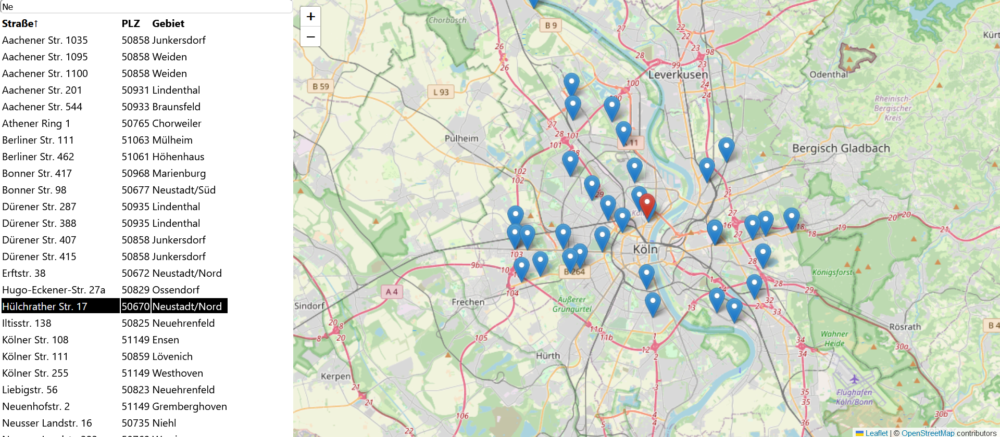

# Übungsaufgabe



## Installation
```sh
$ git clone https://github.com/ankardon/tankapp.git
$ cd tankapp
$ npm install
$ npm start
```
## Kollaboratives Arbeiten

Mittel die man für die optimale Zusammenarbeit und verbesserung der Code Qualität einsetzen kann sind vielfältig.

- Betriebliche Prozesse wie regelmäßiges Pair Programming vor Ort oder durch Plugins wie Live Share in VSCode fördern den Wissenstransfer innerhalb des Teams und ermöglich gleichzeitig eine potentiell bessere Code Qualität, druch gemeinsames Lösen der Probleme beim Pair Progrmaming.
- Um parallel verschiedene features bearbeiten zu können und diese anschließend zusammenzuführen, ist git oder ein anderes System zur Versionskontrolle essentiell. Neben der Verwaltung der Versionsgeschichte hilft git z.B. auch dabei, durch Diff-Funktionen Unterschiede im Code festzustellen, bevor die Änderungen über einene Merge vereinigt werden.
- Um den Code für alle Beteiligten zugänglich zu machen, kann er auf einer Plattform wie GitHub oder GitLab gehostet werden.
- Für die Qualitätssicherung sollten zusätzlich statische Codeanalyse eingesetzt werden. So können Linter dabei helfen, fehleranfällige Stellen zu erkennen.
- Indem sich das Team auf einheitliche Regeln und Konventionen einigt für z.B. Namensgebung, Organisation des Codes innerhalb einer Datei, Odnerstruktur der Projekte, ..., wird die funktionalität für Kollegen, die nicht den Code geschrieben haben, ersichtlicher. Beispielsweise könnten Assets im /Assets Ordner abgelegt werden, womit man direkt weiß, was für Dateien dort liegen und an welcher Stelle man bezüglich ebendiesen Assets schauen kann.
- Automatische Code Formatter sollten verwendet werden, um ein einheitliches Format zu erzwingen. Das hilft insbesondere auch dabei, die Anzahl der Änderungen die bei einem Diff dargestell werden, auf die semantisch wichtigen Stellen zu konzentrieren, statt kleine syntaktische Formatunterschiede wie optionale Leerzeichen zu highlighten.
- Eine CI-Pipeline oder eine interne Konvention könnten genutzt werden, um Tests durchzuführen und einen Branch in git nur dann zum Mergen freizugeben, wenn dieser alle erfolgreich durchlaufen wurden. Tests können z.B. mit Jest oder Playwright implementiert werden, um automatisiert Funktionalitäten zu prüfen.
- Code Reviews vor jedem Merge sind auch ein wichtiger Prozess, bei dem eine weitere Person vor dem mergen die Änderungen überblickt und optimalerweise auch testet. Hier kann nochmal sichergestellt werden, dass die internen Standards im Code eingehalten werden, dass der Merge tatsächlich die entsprechende Issue löst und keine neuen Probleme erzeugt. - Um sicherzustellen, dass die Entwicklungsumgebung bei allen Entwicklern identisch ist, könnte zusätzlich ein Devcontainer eingerichtet und gemeinsam verwendet werden.

## Umsetzung einer eigenen CRUD-Schnittstelle

Eine CRUD-Schnittstelle erfüllt die Operationen **C**reate, **R**ead, **U**pdate, **D**elete und bezeichnet Möglichkeiten, um Daten über eine Schnittstelle zu verwalten. Bisher haben wir nur eine Read Operation auf offenedaten-koeln.de durchgeführt. Um unsere eigene API zu realisieren, schlache ich vor, einene RESTful Server zu nutzen. Dieser könnte z.B. node.js als Plattform und express.js als Framework verwenden. Da die Datenquelle JSON ist, eignet sich MongoDB als Datenbank gut, da sie ebenfalls ein JSON-ähnliches Format verwendet. Es könnte aber auch genausogut PostgreSQL genommen werden, das auch Möglichkeiten zum Umgang mit JSONs bietet. Oder eine beliebige relationale Datenbank, wenn man die Daten in ein entsprechenendes relationales Schema transformiert.

Ein einfaches Grunddesign könnte die 4 Operationen mit 4 Endpunkten abbilden:

- POST createObject
  Der createObject endpoint würde im Body ein JSON verlangen, dass den Inhalt eines der Objekte darstellt ({adresse: <string>, lat: <double>, lng: <double>}). In der MongoDB hätten wir eine Collection solcher Objekte und würden ein weiteres Objekt in diese Collection mit den Übergebenen Daten hinzufügen. Gleichzeit würden wir für diesen Eintrag auch eine ObjectId generieren, die ihn in den anderen Aufrufen eindeutig identifiziert.

- GET getObjects
  Der /getObject-Endpunkt könnte sämtliche Objekte im JSON-Format zurückliefert, ähnlich wie die Tankstellendaten in der vorgegebenen API. Es könnten aber auch komplexe queries zugelassen werden, die eine vorauswahl treffen, sowie der query den wir in der URL der für die Programmieraufgabe vorgegebenen API finden.

- PATCH updateObject/:ObjectId
  Der /updateObject-Endpunkt könnte per Patch ein JSON mit den veränderten Werten liefern. Der Zielpfad enthält die ObjectId des zu aktualisierenden Objekts.

- DELETE deleteObject/:ObjectId
  Die Löschfunktion würde über /deleteObject laufen und die ID des zu entfernenden Objekts im Pfad erwarten.

Um die Daten zu schützen, sollte bei allen Endpunkten, außer dem Lese-Endpunkt, eine Nutzerautorisierung implementiert werden.
Dafür könnte in express.js eine Middleware wie Passport.js genutzt werden.

Hosting der Applikation

Für das Hosting der SPA sollte sie zunächst in ein kompaktes Bundle gebaut und minified werden. Eine einfache Hosting-Option, falls keine eigene CRUD-Schnittstelle implementiert wird, ist das Hosten als statische Seite auf einem Dienst wie GitHub Pages. Soll jedoch die CRUD-Funktionalität enthalten sein, wird ein Server für die Ausführung des Codes benötigt. Dies kann z.B. auf einem eigenen Server oder bei Anbietern wie AWS mit EC2 instanzen oder auf Azure erfolgen. Die MongoDB-Datenbank könnte ebenfalls entweder auf einem eigenen Server gehostet oder als Managed Service gemietet werden.


# Getting Started with Create React App

This project was bootstrapped with [Create React App](https://github.com/facebook/create-react-app).

## Available Scripts

In the project directory, you can run:

### `npm start`

Runs the app in the development mode.\
Open [http://localhost:3000](http://localhost:3000) to view it in your browser.

The page will reload when you make changes.\
You may also see any lint errors in the console.

### `npm test`

Launches the test runner in the interactive watch mode.\
See the section about [running tests](https://facebook.github.io/create-react-app/docs/running-tests) for more information.

### `npm run build`

Builds the app for production to the `build` folder.\
It correctly bundles React in production mode and optimizes the build for the best performance.

The build is minified and the filenames include the hashes.\
Your app is ready to be deployed!

See the section about [deployment](https://facebook.github.io/create-react-app/docs/deployment) for more information.

### `npm run eject`

**Note: this is a one-way operation. Once you `eject`, you can't go back!**

If you aren't satisfied with the build tool and configuration choices, you can `eject` at any time. This command will remove the single build dependency from your project.

Instead, it will copy all the configuration files and the transitive dependencies (webpack, Babel, ESLint, etc) right into your project so you have full control over them. All of the commands except `eject` will still work, but they will point to the copied scripts so you can tweak them. At this point you're on your own.

You don't have to ever use `eject`. The curated feature set is suitable for small and middle deployments, and you shouldn't feel obligated to use this feature. However we understand that this tool wouldn't be useful if you couldn't customize it when you are ready for it.

## Learn More

You can learn more in the [Create React App documentation](https://facebook.github.io/create-react-app/docs/getting-started).

To learn React, check out the [React documentation](https://reactjs.org/).

### Code Splitting

This section has moved here: [https://facebook.github.io/create-react-app/docs/code-splitting](https://facebook.github.io/create-react-app/docs/code-splitting)

### Analyzing the Bundle Size

This section has moved here: [https://facebook.github.io/create-react-app/docs/analyzing-the-bundle-size](https://facebook.github.io/create-react-app/docs/analyzing-the-bundle-size)

### Making a Progressive Web App

This section has moved here: [https://facebook.github.io/create-react-app/docs/making-a-progressive-web-app](https://facebook.github.io/create-react-app/docs/making-a-progressive-web-app)

### Advanced Configuration

This section has moved here: [https://facebook.github.io/create-react-app/docs/advanced-configuration](https://facebook.github.io/create-react-app/docs/advanced-configuration)

### Deployment

This section has moved here: [https://facebook.github.io/create-react-app/docs/deployment](https://facebook.github.io/create-react-app/docs/deployment)

### `npm run build` fails to minify

This section has moved here: [https://facebook.github.io/create-react-app/docs/troubleshooting#npm-run-build-fails-to-minify](https://facebook.github.io/create-react-app/docs/troubleshooting#npm-run-build-fails-to-minify)
